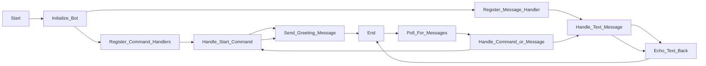

# Telegram Bot POC

This project is a proof of concept for a Telegram bot implemented in Python 3 using a virtual environment (venv).

## Installation

1. Clone the repository:

    ```shell
    git clone https://github.com/your-username/poc.git
    cd /bot/telegram/basic/
    ```

2. Create and activate a virtual environment:

    ```shell
    python3 -m venv venv
    source venv/bin/activate
    ```

3. Install the required dependencies:

    ```shell
    pip install -r requirements.txt
    ```

## Usage

To run the Telegram bot, execute the following command:


