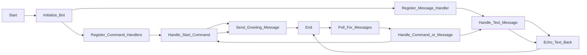

```mermaid
graph LR

Start --> Initialize_Bot
Initialize_Bot --> Register_Command_Handlers
Initialize_Bot --> Register_Message_Handler
Register_Command_Handlers --> Handle_Start_Command
Register_Message_Handler --> Handle_Text_Message
Handle_Start_Command --> Send_Greeting_Message
Handle_Text_Message --> Echo_Text_Back
Send_Greeting_Message --> End
Echo_Text_Back --> End
End --> Poll_For_Messages
Poll_For_Messages --> Handle_Command_or_Message
Handle_Command_or_Message --> Handle_Start_Command
Handle_Command_or_Message --> Handle_Text_Message
Handle_Start_Command --> Send_Greeting_Message
Handle_Text_Message --> Echo_Text_Back

```